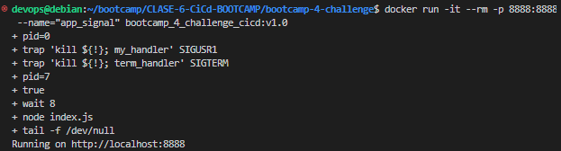
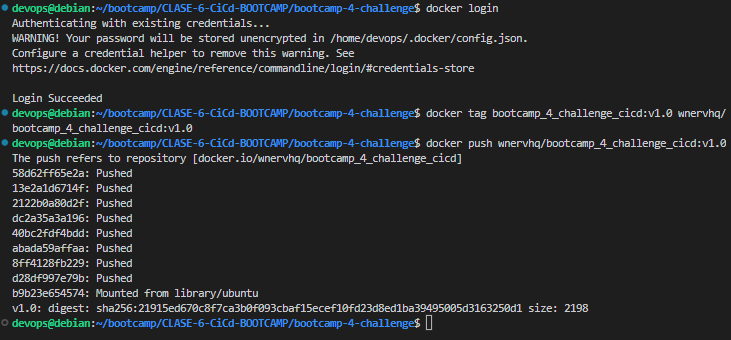
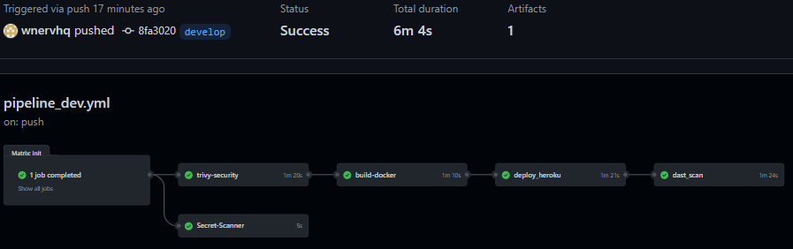

# Solucion Bootcamp-4-Challenge CICD

## Práctica 1

Dado este proyecto en NodeJS, crea su Dockerfile sabiendo que nos han pedido como imagen base ubuntu:18.04, versión 16 de NodeJS, el 8888 será el puerto donde exponga la comunicación la applicación, la señal de *STOP* debe llegarle a la aplicación y el contenedor podría ser iniciado con cualquier proceso.   

se hicieron las siguientes cambios:   
- index.js  
    - En la linea 5 se agregó para que leyera adicionalmente el puerto de la variable de entorno PORT esto es útil mas adelante cuando se despliega en heroku y aws
    - En la linea 17 se declaró la constante 'server' 
    - A partir de la linea 20 a la 25 se agregó un callback que demuestra que la señal de stop llega correctamente a la aplicación   

se crearon los siguientes archivos
- Dockerfile   
    donde se arma segun los requerimientos solicitados la imagen del contenedor es importante que en el punto de entrypoint usar la sintaxis con corchetes y comillas para trasladar correctamente los SIGNALS   

https://github.com/wnervhq/bootcamp-4-challenge/blob/6808db13443865a591f0d8ee2906301242ebf0b5/Dockerfile#L1-L24

- program.sh   
    script de paso para mostrar las SIGNALS recibidas con sus estados, es importante tener en cuenta que en la linea 26 se puede llamar la app indicando 'npm start' lo adecuado es usar ´´node (nombre_app).js´´ en este caso fue '''node index.js''' para poder traslador correctamente las SIGNALS   

se procedio a probar la imagen de manera local
se contruye en base al Dockerfile con la siguiente linea de comando
    
    docker build -t bootcamp_4_challenge_cicd:v1.0 .

   
   
   

    docker run -it --rm -p 8888:8888 --name="app_signal" bootcamp_4_challenge_cicd:v1.0

   

    docker stop app_signal

   

La intencion de capturar y usar las SIGNALS del sistema host es lograr Gracefully Stopping Docker Containers, por ejemplo si se da el caso de que la app esta recibiendo request para ingreso de datos y por ejemplo se requiere una actualizacion de emergencia de la app, esta procederia a recibir la SIGNAL SIGTERM y se indique que el sistema va a dejar de tomar request y que culminará con las tareas pendientes para luego volver arrancar el contenedor con la finalidad de no perder data   

   

## Práctica 2

Sube la imagen de Docker a DockerHub.   

    docker login
    docker tag bootcamp_4_challenge_cicd:v1.0 wnervhq/bootcamp_4_challenge_cicd:v1.0
    docker push wnervhq/bootcamp_4_challenge_cicd:v1.0

   

   

## Práctica 3

Automatiza el proceso de creación de la imagen de Docker y su subida a Docker Hub después de cada cambio en el repositorio utitlizando Github Actions.   

https://github.com/wnervhq/bootcamp-4-challenge/blob/6808db13443865a591f0d8ee2906301242ebf0b5/.github/workflows/pipeline_dev.yml#L1-L109   

https://github.com/wnervhq/bootcamp-4-challenge/blob/6808db13443865a591f0d8ee2906301242ebf0b5/.github/workflows/pipeline_master.yml#L1-L46   

## Práctica 4

Se debe crear una aplicación en Heroku y desplegarla allí usando github actions.

se realizó el despliegue de la rama develop en heroku   

   
   
   

al ser validado los cambios en desarrollo se hizo un despliegue en aws   

   
   
   
